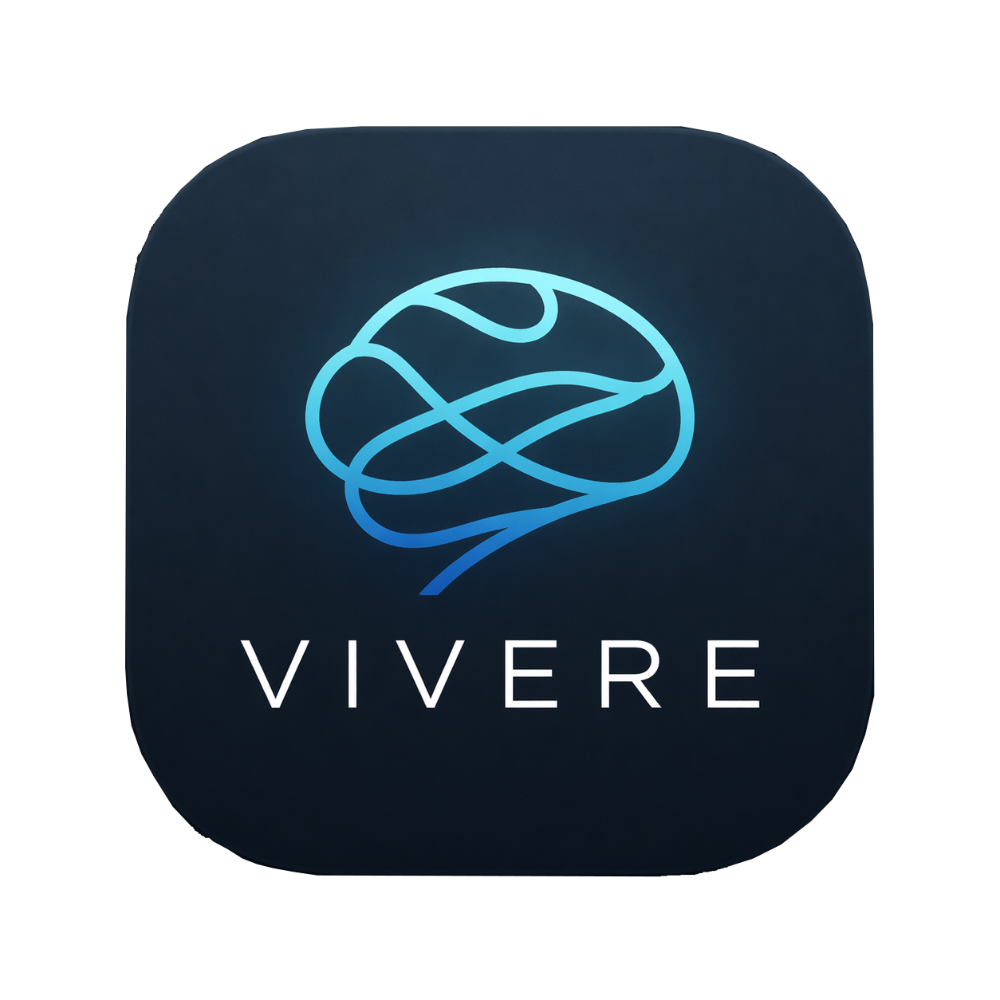

# Vivere 🌸

<p align="center">
  
</p>

<p align="center">
  <strong>vi·ve·re</strong> <code>/ˈwiː.we.re/</code> — <em>(Latin) To live, to be alive.</em>
</p>
 
<p align="center">
  
  
  
  
</p>

---

## 📖 About Vivere

Vivere is a minimalist, premium, privacy-first mental wellness and daily tracker designed to combat cognitive load. Whether you are navigating burnout, anxiety, depression, or simply looking to organize your days with zero pressure, Vivere provides a calm, beautiful space to log your emotions, plan your day, and center your mind.

---

## 🎯 Use Cases & Practical Scenarios

Vivere is designed specifically for individuals experiencing mental fatigue, burnout, or sensory overload:

| Scenario / Challenge | How Vivere Solves It | Feature in Action |
| :--- | :--- | :--- |
| **Cognitive Fatigue / Depression** | Typing feels like too much effort. You want to journal but can't find the energy to write. | **Audio Brain Dump**: Tap once and talk. Your thoughts are recorded and saved locally. |
| **Panic Attack / Acute Anxiety** | Heart rate is spiking, and you need immediate grounding to center your mind. | **Take a Breath**: A simple, glowing animated breathing guide to regulate your nervous system. |
| **Medication Adherence** | Forgetting whether you took your daily medicine but hate complicated logs. | **One-Tap Meds Log**: Tap the glowing card on the dashboard to log/verify compliance. |
| **Task Guilt / ADHD** | Standard planner apps create stress with streaks and strict dates. | **Plans vs. Reality**: Add goals, check them off when done, with no negative reinforcement for undone items. |

---

## 🌟 Key Features

### 1. Expressive Mood Logging
Check-in with yourself effortlessly. Choose from six mood status nodes represented by unique HSL-tailored colors:
*   💙 **Crying** — *Feeling overwhelmed or sad.*
*   ❤️ **Hurting** — *Experiencing pain or emotional distress.*
*   💚 **Ok** — *A balanced, neutral baseline.*
*   💛 **Happy** — *Feeling positive and joyful.*
*   💜 **High Confidence** — *Empowered and capable.*
*   💖 **Hyper** — *High energy and active.*

### 2. Audio Brain Dump
*   **Zero-friction journaling**: Tap the microphone button to record audio entries.
*   **Privacy-first storage**: Files are saved directly to your device's internal app documents folder (completely offline).

### 3. Plans vs. Reality (Task Tracker)
*   Manage daily tasks and habits without stress.
*   **Quick Presets**: Log essential tasks instantly with built-in presets (Food, Sleep, Walk, Hydrate, Exercise, Socialize, Medicine).

### 4. Interactive Grounding (Breathwork)
*   A dedicated guided breathing companion screen featuring an interactive glowing circle that dynamically scales (Breathe In / Breathe Out) to assist during stressful episodes.

### 5. Stats & Visual Heatmap
*   **Mood Heatmap**: A visual 30-day grid representing your daily dominant mood color.
*   **Medicine Ring Tracker**: A border around the calendar cells denoting dates when medication was successfully logged.
*   **Extended History**: Filter logs by date and view a beautiful history timeline.

---

## 🛠️ Technical Stack

*   **UI & Core**: [Flutter SDK](https://flutter.dev/) (Material 3 enabled)
*   **Local Storage**: [Hive](https://pub.dev/packages/hive) NoSQL DB for blazing-fast offline operations.
*   **State Management**: [Provider](https://pub.dev/packages/provider).
*   **Animations**: [Flutter Animate](https://pub.dev/packages/flutter_animate) for ambient glow and particle scaling.
*   **Fonts**: Google Fonts ([Outfit](https://fonts.google.com/specimen/Outfit)).

---

## 📂 Project Directory Structure

```text
lib/
├── main.dart               # App initialization, custom theme, and Hive database boxes setup
├── models/
│   ├── activity_task.dart  # Task schema details
│   ├── daily_record.dart   # Medicine logs schema
│   └── mood_log.dart       # Mood levels and logs models
├── providers/
│   └── app_state.dart      # Global provider managing stats, Hive, and states
├── screens/
│   ├── audio_journal_widget.dart  # Handles offline sound recording and saving
│   ├── daily_track_screen.dart    # Interactive 'Plans vs Reality' tracker
│   ├── grounding_screen.dart      # Calming guided breathing animation
│   ├── home_screen.dart           # Dashboard, 24h Activity, and Meds Check-in
│   ├── log_entry_screen.dart      # Sliding overlay sheet for all presets & custom logs
│   ├── splash_screen.dart         # Intro screen
│   └── stats_screen.dart          # Monthly heatmaps and detailed metrics logs
└── widgets/
    └── glass_card.dart            # Reusable glassmorphic UI container
```

---

## 🚀 Setup & Installation

### Prerequisites
Ensure you have the [Flutter SDK](https://docs.flutter.dev/get-started/install) installed on your system.

### Local Execution

1.  **Clone the repository**:
    ```bash
    git clone https://github.com/amal-infosec/Vivere.git
    cd Vivere
    ```

2.  **Fetch packages**:
    ```bash
    flutter pub get
    ```

3.  **Run code generation**:
    Generate the Hive adapter classes needed for local serialization:
    ```bash
    flutter pub run build_runner build --delete-conflicting-outputs
    ```

4.  **Launch application**:
    Ensure your device or emulator is connected, then run:
    ```bash
    flutter run
    ```

---

## 🔒 Privacy & Safety Statement

Vivere operates **100% client-side**. 
- No analytics trackers or tracking scripts are integrated.
- No network requests are made.
- Your logs, habits, and voice files are stored directly inside the sandbox filesystem of your own device.
